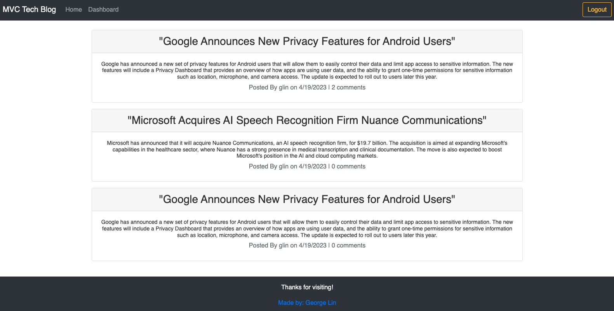

<h1 align="center">🌃 Tech Topia 🌉</h1>

    
    
    
    
    

  

    
    
    
    
    
    
    

## Description
Tech Topia is a simple blogging platform where users can share their thoughts and ideas freely about technology. It was built using the Model-View-Controller (MVC) architecture and is powered by Node.js, Express, and Sequelize.

## Table of Contents
- [Description](#description)
- [Table of Contents](#table-of-contents)
- [Usage](#usage)
- [Testing](#testing)
- [Contributing](#contributing)
- [Future Developments](#future-developments)
- [Questions](#questions)

# Getting Started 🛫🚀
Vist the deployed application [here:](https://salty-escarpment-75957.herokuapp.com/) and signup or login to get started 

# Usage 🐱‍💻 
Once logged in, you can use Tech Topia to create, view, and edit blog posts. You can also leave comments on other users' posts.

To create a new post, simply click on the "Add New Post" button on the dashboard page. You will be prompted to enter a title and the post content.

To view all the posts, click on the "Homepage" button on the navigation bar at the top of the page. You can then click on any post to view its full details, including the comments.

To leave a comment on a post, simply enter your comment in the input field below the post and click on the "Add Comment" button.

To edit or delete a post, click on the post title on the dashboard page, then update post title and content accordingly and click the "Save changes" button to save your changes or simply click "delete" if you wish to have your post deleted. 
# Testing 🧪 

No testing is currently set up 
# Contributing ⚒️

:octocat: [George Lin](https://github.com/lingeorge88)

If you would like to contribute to Tech Topia, you can simply fork the repository and create a pull request with your changes. We welcome any contributions, including bug fixes, feature enhancements, and documentation improvements.
# Future developments 🚧
- Allow users to add images to their posts
- Give users more customization options to build a more personalized profile
- Improve styling and accessibility
# Questions 📬
 

✉️ Contact me with any further questions:  [GitHub](https://github.com/lingeorge88)